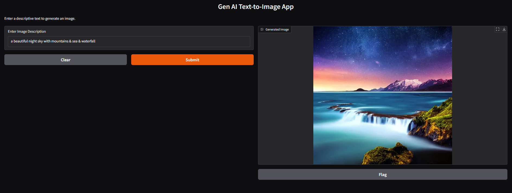

# GenAI Text-to-Image Generator

A simple Generative AI application that converts text prompts into images using Stable Diffusion v1.5.

## Technologies Used

- Python
- Stable Diffusion
- Hugging Face Diffusers
- PyTorch
- Gradio

## Example Prompt

"A beautiful night sky with mountains, sea & waterfall"

## Features

- Text-to-image generation
- Interactive Gradio UI
- Real-time image creation

## Screenshot

